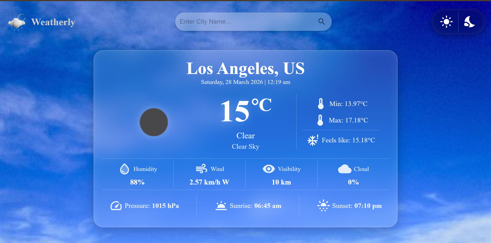
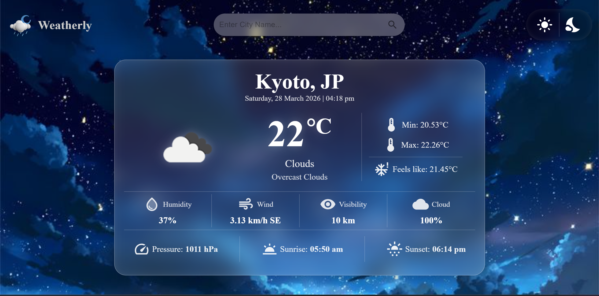

# 🌦 Weather App (React)

A modern **React-based Weather Application** that provides real-time weather updates for any city using the **OpenWeather API**. Users can search for locations and view detailed weather information including temperature, humidity, wind, and accurate sunrise/sunset timings.

The app focuses on clean UI design, API integration, and dynamic data handling using modern React practices.

> 🎓 Built while learning React, API handling, and frontend development.

---

## ✨ Features

* 🔍 Search weather by city name
* 🌡 Real-time temperature, min/max & feels-like data
* 🌥 Weather conditions with icons
* 💧 Humidity, pressure & visibility
* 🌬 Wind speed & direction
* 🌅 Accurate sunrise & sunset timings (timezone adjusted)
* 🕒 Live date & time based on location
* 🌗 Light & Dark theme support  
* 🎨 Clean and minimal UI design
* ⚡ Fast API-based data fetching

> ❗ Note: This project is **not fully responsive** yet.

---

## 🛠 Tech Stack

**Frontend**

* React.js (Vite)
* JavaScript (ES6+)
* CSS

**API**

* OpenWeather API (Geocoding + Weather)

---

## 📂 Project Structure
```
Weather-app-react/
│
├── node_modules/        # Installed dependencies
├── public/              # Public assets
├── screenshots/         # Project preview images
│
├── src/
│   ├── assets/          # Images (dark.jpg, light.jpg, weather.png)
│   │
│   ├── App.css          # Main app styling
│   ├── App.jsx          # Root component
│   ├── index.css        # Global styles
│   │
│   ├── InfoBox.css      # InfoBox styles
│   ├── InfoBox.jsx      # Weather info display component
│   │
│   ├── NavBar.css       # Navbar styles
│   ├── NavBar.jsx       # Navigation bar component
│   │
│   ├── SearchBox.css    # Search input styles
│   ├── SearchBox.jsx    # City search component
│   │
│   ├── WeatherApp.css   # Main weather app styles
│   ├── WeatherApp.jsx   # Main weather container component
│   │
│   ├── WeatherInfo.js   # API handling & weather logic
│   └── main.jsx         # Entry point
│
├── .env                 # Environment variables (API key)
├── .gitignore           # Ignored files
├── eslint.config.js     # ESLint configuration
├── index.html           # Root HTML file
├── package.json         # Project metadata & dependencies
├── package-lock.json    # Dependency lock file
├── vite.config.js       # Vite configuration
└── README.md            # Project documentation
```
---

## 🚀 Getting Started

### 1️⃣ Clone the Repository

```bash
git clone https://github.com/Akarsh-Coding/Weather-app-react.git
cd Weather-app-react
```

---

### 2️⃣ Install Dependencies

```bash
npm install
```

---

### 3️⃣ Setup Environment Variables

Create a `.env` file in the root directory:

```
VITE_API_KEY=your_openweather_api_key
```

Get your API key from 👉 [https://openweathermap.org/api](https://openweathermap.org/api)

---

### 4️⃣ Run the Application

```bash
npm run dev
```

App runs on:

```
http://localhost:5173
```

---

## 🧭 Usage

* Enter a city name in the search bar
* View detailed weather information instantly
* Check temperature, humidity, wind, and conditions
* See correctly adjusted **sunrise & sunset times**
* Track local date and time for the searched city

---

## 🖼 Preview

### 🌗 Light & Dark Theme

<table align="center">
<tr>
<td align="center" width="50%">
🌞 Light Theme  

</td>

<td align="center" width="50%">
🌙 Dark Theme  

</td>
</tr>
</table>

---

## ⚠️ Known Limitations

* ❌ Not fully responsive (best viewed on desktop)
* 🌍 Timezone handled via offset (not full timezone name)
* 🔑 Requires API key for functionality

---

## 🚀 Future Improvements

* 📱 Make fully responsive (mobile + tablet)
* 📍 Detect user location automatically
* ⏱ Real-time weather updates
* 🌐 Use accurate timezone names instead of offsets
* 🎨 Improve UI/UX animations

---

## 📦 Modules Used

### ⚛ Frontend

* react – UI library for building components
* vite – Fast development build tool

### 📡 API Handling

* fetch API – For making HTTP requests

### 🌍 Weather API

* OpenWeather Geocoding API – Convert city → coordinates
* OpenWeather Weather API – Fetch weather data

---

## 👨‍💻 Author

**Akarsh Kumar**\
Frontend Developer (Learning Phase 🚀)\
Passionate about building real-world projects with React & APIs

---

## 📜 License

This project is licensed under the MIT License.

---

⭐ If you found this project helpful, consider giving it a star on GitHub!

---
